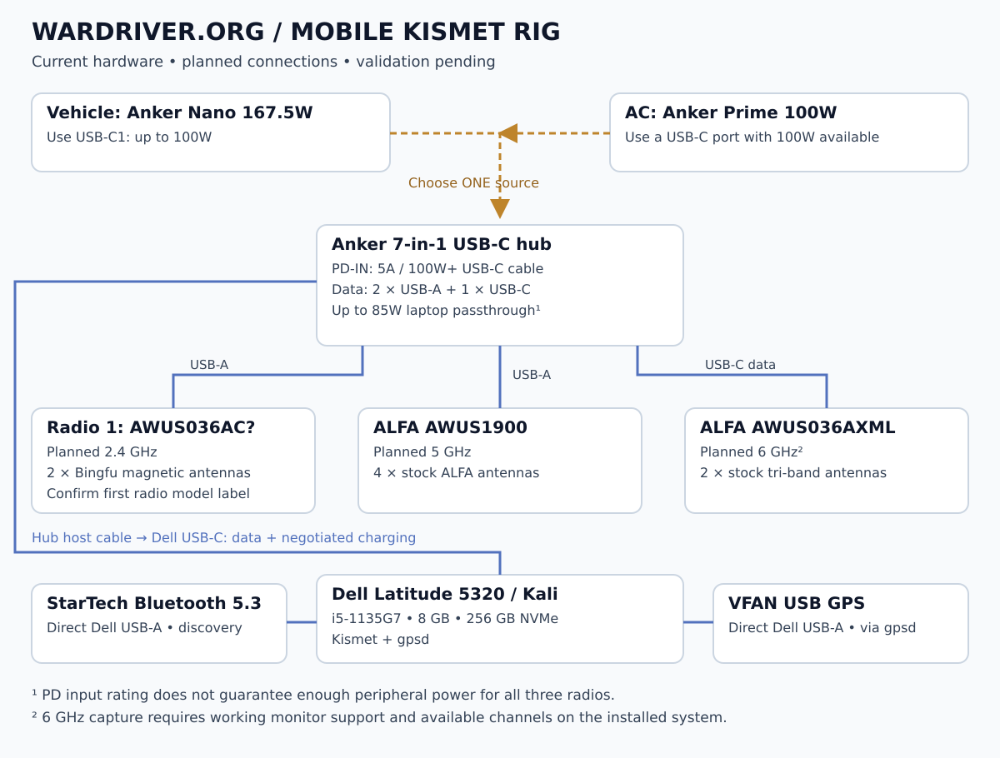

<p align="center"></p>

# Wardriver.org • Mobile Kismet Rig

My current hardware and planned wiring for a Kali Linux wardriving laptop: three ALFA Wi-Fi radios, Bluetooth discovery, and USB GPS.

**Build log · October 1, 2026 · Hardware validation pending**



## The setup

| Component | Hardware | Role | Amazon | Price (USD) |
| --- | --- | --- | --- | --- |
| Laptop | Dell Latitude 5320, i5-1135G7, 8 GB RAM, 256 GB NVMe, 13.3″ FHD | Kali Linux + Kismet | [Search exact configuration](https://www.amazon.com/s?k=Dell+Latitude+5320+i5-1135G7+8GB+256GB) | Varies by condition/configuration |
| USB hub | Anker 7-in-1: 2× USB-A data, 1× USB-C data, PD-IN, HDMI, SD/microSD | Connects the three Wi-Fi radios | [Owner’s link](https://a.co/d/0bJluWtu) | Check listing |
| Wi-Fi radio 1 | ALFA **AWUS036AC — model label needs confirmation** | Planned 2.4 GHz survey | [AWUS036AC — confirm model](https://www.amazon.com/dp/B01B33WU82) | Check listing |
| Wi-Fi radio 2 | ALFA AWUS1900, four stock antennas | Planned 5 GHz survey | [View on Amazon](https://www.amazon.com/dp/B01MZD7Z76) | Check listing |
| Wi-Fi radio 3 | ALFA AWUS036AXML, two stock tri-band antennas | Planned 6 GHz survey, subject to driver/channel support | [View on Amazon](https://www.amazon.com/dp/B0BY8GMW32) | $59.99 reference¹ |
| External antennas | Two Bingfu magnetic-base 2.4/5 GHz antennas | Planned on radio 1 after connector/model check | [View on Amazon](https://www.amazon.com/dp/B07MYXG3W8) | Check listing |
| Bluetooth | StarTech Bluetooth 5.3 Class 1 USB adapter; AV53C1 model identified in planning | Bluetooth/BLE discovery | [View on Amazon](https://www.amazon.com/dp/B0F1G6XT38) | Check listing |
| GPS | VFAN USB GPS puck, listed UBX-G7020KT receiver | Position through gpsd | [View on Amazon](https://www.amazon.com/dp/B073P3Y48Q) | Check listing |
| Vehicle power | Existing Anker Nano 167.5W car charger, USB-C1 up to 100W | Hub PD input | [View on Amazon](https://www.amazon.com/dp/B0CZ7BL16W) | Check listing |
| Wall power | Purchased Anker Prime 100W USB-C charger | Hub PD input from AC | [A2688 — confirm variant](https://www.amazon.com/dp/B0CZ6LXL8R) | Check listing |
| Power cable | USB-C to USB-C | Verify 5A/e-marked 100W or 240W rating | [Search 5A cables](https://www.amazon.com/s?k=USB+C+100W+5A+e-marked+cable) | Exact cable not specified |

**Price lookup: October 1, 2026.** These are regular, non-affiliate Amazon links. [AmazonSmile ended February 20, 2023](https://www.aboutamazon.com/news/company-news/amazon-closing-amazonsmile-to-focus-its-philanthropic-giving-to-programs-with-greater-impact). Prices vary by seller, condition, shipping destination, tax, and promotions. “Check listing” means a price could not be verified from the retrieved Amazon page; it does not mean the item is unavailable. Search links are labeled and do not identify the exact purchased item.

¹ The AXML’s $59.99 reference price appeared in an [Amazon related-product offer](https://www.amazon.com/ALFA-AWUS036AXM-Adapter-Tri-Band-Wireless/dp/B0C7VLCK7V) for ASIN B0BY8GMW32, sold by SHALSOFT, in indexed content retrieved during this lookup. It is not a live checkout quote or the owner’s purchase price. No total is shown because the other prices are unverified.

The first radio was originally written as **AWUS03BAC**. AWUS036AC is the working assumption from the build discussion, not a confirmed label. Check the actual adapter before selecting drivers or antennas. The hub matches the A83D2 published port layout; confirm its underside label as well.

## Connections

| Port | Connect to |
| --- | --- |
| Hub attached host cable | Dell Thunderbolt/USB-C port |
| Hub USB-A data port 1 | Radio 1 |
| Hub USB-A data port 2 | AWUS1900 |
| Hub USB-C **data** port | AWUS036AXML, with a USB data-capable cable |
| Dell USB-A port 1 | StarTech Bluetooth adapter |
| Dell USB-A port 2 | VFAN GPS |
| Hub **PD-IN** | One USB-C PD power source |

The hub has **three USB data ports**. PD-IN is not a fourth data port. Bluetooth and GPS attach directly to the laptop.

The host cable carries USB data and negotiated charging power. With suitable PD input, the hub can charge the laptop, so a separate Dell charger should normally be unnecessary. This still needs a full-load test on the actual rig.

## Power

- **In the car:** vehicle socket → Anker Nano USB-C1 → 5A USB-C cable → hub PD-IN.
- **At a desk:** AC outlet → Anker Prime 100W → 5A USB-C cable → hub PD-IN.
- **Optional AC fallback in the car:** suitable inverter → Anker Prime → hub. The existing PiSFAU and other inverter are alternatives, not required components in the preferred vehicle wiring.

The matching Anker hub specification lists up to **100W input / 85W laptop charging**. That is not a promise of 15W usable by the Wi-Fi adapters: hub electronics, shared USB budgets and per-port limits still apply. A higher-wattage charger does not raise those limits. If radios reset under load, test each directly, check cables, and evaluate a dedicated powered USB data hub with documented output limits.

Keep the car socket's rated load within its vehicle-manual limit, including other devices on the same circuit. Multiport charger power allocation can change when more devices are attached.

## Get started

Plug in the rig and keep Internet access on the laptop's internal Wi-Fi or Ethernet. From this repository directory, run the [Kali setup wizard](setup-kali-rig.sh):

```bash
sudo bash setup-kali-rig.sh
sudo wardriver start
```

Select each USB radio, its survey band, the StarTech Bluetooth controller, and the VFAN GPS serial path when prompted. Open <http://127.0.0.1:2501> and verify all sources and the GPS position.

```bash
sudo wardriver status
sudo wardriver logs
sudo wardriver stop
```

Captures are saved to `/var/lib/wardriver/captures`. See [setup instructions, troubleshooting, and rollback](KALI-RIG-README.txt). The script passed Bash syntax and channel-parser checks; hardware validation is pending.

For manual setup, follow [Kali and Kismet setup](kali-kismet.md), use `bash inspect-rig.sh` to identify devices, and adapt [the configuration template](kismet_site.conf.example). Complete the [hardware validation checklist](validation.md) before a survey.

**The band assignments are targets, not measured results.** No capture logs or runtime tests from this laptop have been supplied yet. In particular, Wi-Fi 6E hardware does not by itself prove working 6 GHz monitor capture on the installed kernel/firmware.

Kismet's standard Linux Bluetooth source performs **active discovery**, not raw Bluetooth packet capture. This rig does not claim to sniff arbitrary Bluetooth connections.

## Antenna placement

Use the two Bingfu antennas for the planned 2.4 GHz radio after confirming the connectors. Keep all four AWUS1900 antenna ports populated with its stock antennas. Keep the AXML's tri-band antennas for 6 GHz; the Bingfu pair is only specified for 2.4/5 GHz. Claimed antenna gain is not a measured result for this build.

Separate the Bluetooth adapter and 2.4 GHz radio from USB 3 electronics using suitable short extensions. Give the GPS puck a clear sky view. Secure equipment and cables before driving; operate the laptop while parked or through a passenger.

## Wardriver workflow

Capture with Kismet → retain the original logs locally → export a format supported by the installed Wardriver-local release → review and import. This repository documents the rig; it does not add a Kismet importer or automatically upload observations to Wardriver.org or WiGLE.

## Images and references

- [Current wiring diagram](wiring.svg) — editable SVG; [PNG copy](wiring.png).
- [Earlier setup illustration](images.md) — retained with its known inaccuracies called out.
- [Hardware links and documentation](sources.md).
- [Publishing this repository](publishing.md).

Capture databases, GPS tracks, credentials, and local device reports belong outside Git. The included `.gitignore` excludes common capture and local configuration files.


