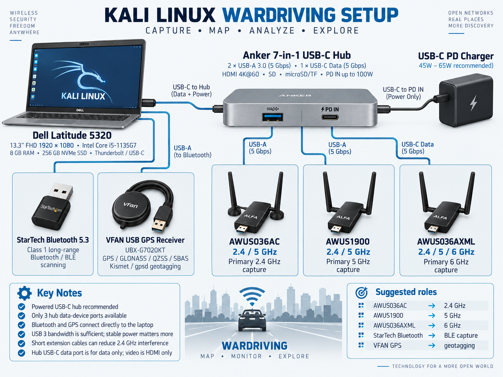

# Images

The README's `wiring.svg` is the current logical wiring plan. It is a repo-native vector diagram, not a product photograph. `wiring.png` is its raster export.

The Wardriver logo and following image were supplied from the project's existing artwork.

## Earlier concept — superseded

This image is retained as build history, not as the wiring authority:

- Its 45–65W recommendation predates the current 100W power plan.
- Its product shapes are illustrative: the AWUS1900 uses four antennas, and the StarTech model discussed has an external antenna.
- The first ALFA model remains unconfirmed.
- It omits the two Bingfu magnetic antennas.
- Standard Linux HCI Bluetooth discovery is not raw BLE packet capture.
- PD passthrough does not establish the hub's available peripheral power budget.

No manufacturer product photos are bundled or represented as photos of the actual assembled rig. Product links are in [sources](sources.md). Brand names and third-party marks remain their respective owners' property.
